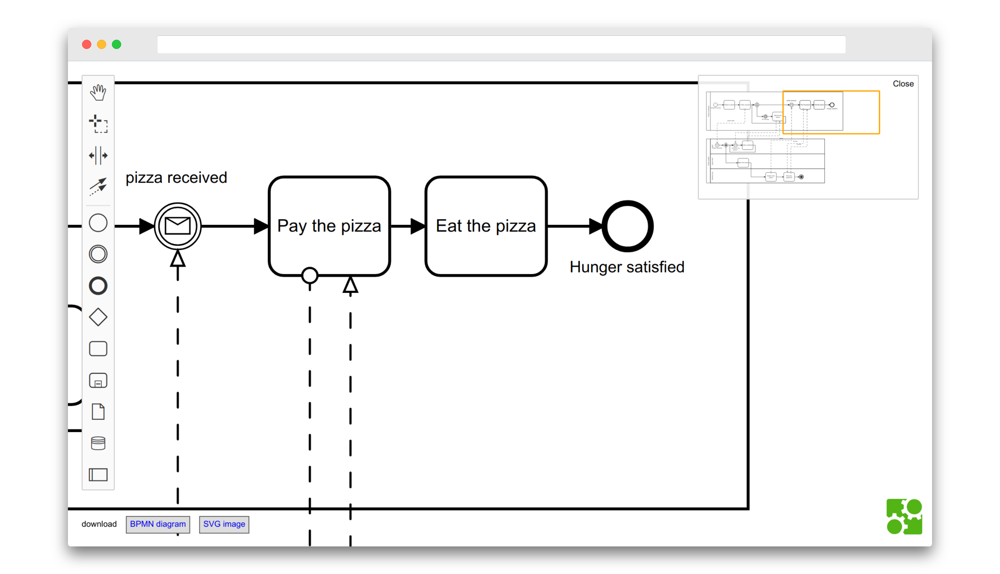

# diagram-js Minimap

[](https://github.com/bpmn-io/diagram-js-minimap/actions/workflows/CI.yml)

A minimap for diagram-js.




## Features

* See the whole diagram in the minimap
* Highlight current viewport
* Click/drag/scroll the minimap to navigate the diagram


## Usage

Extend your diagram-js application with the minimap module. We'll use [bpmn-js](https://github.com/bpmn-io/bpmn-js) as an example:

```javascript
import BpmnModeler from 'bpmn-js/lib/Modeler';

import minimapModule from 'diagram-js-minimap';

var bpmnModeler = new BpmnModeler({
  additionalModules: [
    minimapModule
  ]
});
```

For proper styling integrate the embedded style sheet:

```html
<link rel="stylesheet" href="diagram-js-minimap/assets/diagram-js-minimap.css" />
```

Please see [this example](https://github.com/bpmn-io/bpmn-js-examples/tree/master/minimap) for a more detailed instruction.


## Configuration

The minimap can be configured via the `minimap` configuration option:

```javascript
var bpmnModeler = new BpmnModeler({
  additionalModules: [
    minimapModule
  ],
  minimap: {
    open: true,             // open the minimap by default (default: false)
    debounceDelay: 100,     // batch element updates within this delay, in ms (default: 100)
    debounceSkipDelay: 2000 // force a refresh at least every this delay, in ms (default: 2000)
  }
});
```

To keep modeling responsive on large diagrams, the minimap batches (debounces)
element additions, removals and changes into a single update, and does not
update at all while it is closed. It rebuilds from the active root the next time
it is opened. User interactions (drag, zoom, click) and viewport changes always
update immediately.


## License

MIT
